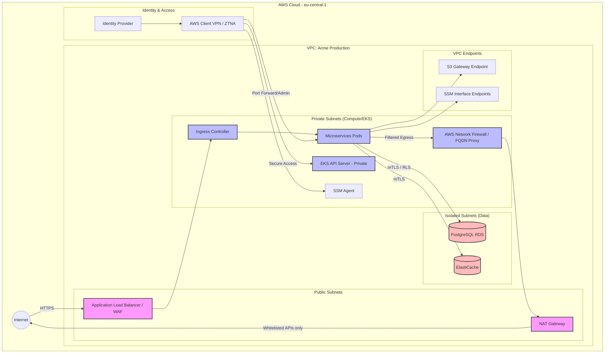

# Architecture Proposal

## A1 — Deployment models by tier

### Comparison Table

| Feature | Standard (Shared) | Enterprise (Dedicated Stack) | Regulated (Dedicated + Data Residency) |
| :--- | :--- | :--- | :--- |
| **Isolation Boundary** | Logical (App/DB Schema). Shared VPC, EKS, RDS. | Physical/Infra. Dedicated VPC, EKS, RDS, ElastiCache. | Strongest. Dedicated AWS Account or strict VPC with IAM boundaries. |
| **Ingress Model** | Shared ALB -> Ingress Controller. Host/Path routing. Global AWS WAF. | Dedicated ALB per tenant. Custom WAF rules, AWS PrivateLink support. | Dedicated ALB, mTLS, AWS Shield Advanced, strictly private endpoints. |
| **Backup Strategy** | AWS Backup (Daily). RDS Automated Snapshots. S3 Versioning. | AWS Backup (Hourly). Cross-Region replication available (if permitted). | Continuous Backup. S3 Object Lock (Immutable). Multi-AZ synchronous. |
| **Target RTO / RPO** | RTO: 4 hours / RPO: 1 hour | RTO: 2 hours / RPO: 15 minutes | RTO: 1 hour / RPO: 5 minutes |
| **Relative Cost** | $ (Lowest cost per tenant) | $$$ (High base cost per tenant) | $$$$$ (Highest base cost, premium services) |
| **Operational Complexity** | Low (Single stack to manage) | High (Requires robust IaC for 20+ stacks) | Very High (Strict compliance auditing, SCPs) |

### Narrative per Tier

#### Standard Tier (Shared Multi-tenant)
The Standard tier is designed for cost-efficiency and maximum resource utilization for SMBs. 
- **Isolation:** Tenants share the same EKS cluster, application instances (Node.js/NestJS pods), and AWS RDS PostgreSQL databases. Isolation is enforced logically at the application layer and via Row-Level Security (RLS) or schema-per-tenant in PostgreSQL. S3 objects use tenant-specific prefixes.
- **Ingress Model:** Traffic enters via a shared Application Load Balancer (ALB) and is routed by an Ingress Controller based on the tenant's hostname or path. A generic AWS WAF web ACL protects the shared endpoint.
- **Backups & RTO/RPO:** Leveraging RDS Automated Backups and AWS Backup for daily snapshots. Target RPO is 1 hour (relying on PITR), and RTO is 4 hours, which provides a standard SLA suitable for non-critical workloads.
- **Operational Trade-offs:** Very easy to update and maintain since there is only one shared production environment. However, there is a risk of "noisy neighbors" impacting performance, and a single critical failure could affect all Standard tier customers.

#### Enterprise Tier (Dedicated Stack per Customer)
This tier targets large enterprises needing predictable performance and isolated infrastructure (a "cell-based" architecture).
- **Isolation:** Each customer receives a dedicated "cell". At minimum, this is a dedicated VPC containing a dedicated EKS cluster (or isolated EKS Node Groups/namespaces), along with dedicated Amazon RDS and ElastiCache instances. This physical separation eliminates the noisy neighbor problem.
- **Ingress Model:** Each cell has its own dedicated ALB. This allows for customized AWS WAF rules per customer and the ability to integrate AWS PrivateLink so customers can access the SaaS privately from their own AWS environments.
- **Backups & RTO/RPO:** More aggressive AWS Backup schedules (hourly snapshots) and RDS Point-in-Time Recovery ensure an RPO of 15 minutes. RTO is reduced to 2 hours using automated IaC redeployment (Terraform/Helm) and fast database restore procedures.
- **Operational Trade-offs:** High cost and operational complexity. Managing 20+ identical environments requires mature GitOps (e.g., ArgoCD or Flux) and strict Terraform automation. Configuration drift detection becomes a critical operational requirement.

#### Regulated Tier (Dedicated Stack + Data Residency)
Built for finance, healthcare, or EU-specific clients requiring SOC 2 Type II, GDPR, and strict data residency controls.
- **Isolation:** The strongest isolation boundary—provisioning a dedicated AWS Account via AWS Organizations for each regulated tenant. This ensures hard IAM and billing boundaries. Data must remain strictly within `eu-central-1`.
- **Ingress Model:** Ingress is heavily locked down. It includes mTLS for API access, AWS WAF with strict rate limiting, and AWS Shield Advanced. All data stores are deployed in private subnets with VPC Endpoints for S3; no traffic traverses the public internet.
- **Backups & RTO/RPO:** Continuous backups with RPO down to 5 minutes and RTO of 1 hour. Backups to S3 use Object Lock (WORM compliance - Write Once, Read Many) to prevent tampering or accidental deletion. Backups are strictly geo-fenced to the EU region using AWS Service Control Policies (SCPs).
- **Operational Trade-offs:** The most expensive and rigid tier. Managing dedicated AWS accounts requires complex AWS Control Tower setups. Access to these environments by Acme engineers must be heavily audited, ephemeral, and strictly controlled (e.g., via AWS Systems Manager Session Manager) to meet SOC 2 requirements.

## A2 — Network & Access Model

### Access Model by Actor
- **End Users:** Access the Acme Platform exclusively through a public-facing Application Load Balancer (ALB) and API Gateway. No direct access to internal VPC resources. AWS WAF is attached to the ALB to protect against common web exploits and DDoS attacks.
- **Platform Engineers:** The Kubernetes (EKS) API server endpoint is private and not exposed to the internet. Engineers access the cluster and internal tools via AWS Client VPN or a Zero Trust Network Access (ZTNA) solution integrated with the company's IdP (Okta/Entra ID). Access to compute nodes for debugging is performed via AWS Systems Manager (SSM) Session Manager (SSM Agent), eliminating the need for SSH keys or public bastion hosts.
- **Customer Support:** Support staff uses a dedicated internal admin portal deployed within the management VPC. They access tenant environments via RBAC policies that grant temporary, audited access to a specific tenant's cell (database or app tier) without cross-tenant exposure. This is enforced using IAM roles tied to their IdP groups and assumed dynamically.
- **Service-to-Service:** Communication between the microservices within the EKS cluster is managed using a Service Mesh (e.g., Istio or Linkerd) or Kubernetes Network Policies (e.g., Cilium/Calico). This ensures mTLS encryption in transit and enforces strict segmentation (e.g., billing service can only talk to the payment gateway, not the user management service).

### Egress Control Policy
To prevent data exfiltration and ensure security compliance (SOC 2 / GDPR), outbound traffic is strictly controlled.
- **Policy:** Pods and services are denied outbound internet access by default. Traffic is only permitted to explicitly whitelisted external dependencies (e.g., Stripe for payments, OpenAI for model APIs, SendGrid for email).
- **Enforcement:** Egress is enforced via EKS Network Policies (default deny) combined with a specialized egress proxy (like Squid Proxy or AWS Network Firewall) to perform FQDN (Fully Qualified Domain Name) filtering. Services can only resolve and connect to approved domains, and any connection to an unknown IP or domain is dropped and logged. Traffic flows through a NAT Gateway for these approved external connections.

### Network Diagram

## A3 — Identity, Secrets & Encryption Keys

### IAM Least Privilege
- **Humans:** Human access is federated via a centralized Identity Provider (e.g., Okta, Entra ID) using AWS IAM Identity Center (formerly AWS SSO). Developers and operators receive temporary, short-lived credentials mapped to specific IAM roles based on their group membership. Default access is strictly read-only.
- **CI/CD:** GitHub Actions (or similar CI/CD tools) authenticate to AWS using OpenID Connect (OIDC). This eliminates the need for long-lived IAM user access keys, relying instead on ephemeral security credentials that are scoped exactly to the deployment role (e.g., pulling ECR images, updating EKS, applying Terraform).
- **Workloads:** Microservices running on EKS use IAM Roles for Service Accounts (IRSA) or EKS Pod Identity. Each Pod is assigned a dedicated IAM role (e.g., `BillingServiceRole`) granting access only to the specific resources it needs (e.g., read access to a specific S3 bucket prefix, no access to other services' data).

### Secrets Storage, Injection, and Rotation
- **Storage:** All application secrets (database passwords, API keys) are stored centrally and encrypted at rest in AWS Secrets Manager.
- **Injection:** Secrets are *never* stored in code, injected as environment variables in plain text within Helm charts, or committed to Git. Instead, the External Secrets Operator (ESO) or AWS Secrets Manager CSI Driver is used to fetch secrets dynamically at runtime and mount them as ephemeral volumes or native Kubernetes Secrets for the Pods.
- **Rotation:** Secrets Manager is configured to automatically rotate database credentials and API keys (where supported) every 30 to 90 days using AWS Lambda rotation functions.

### Data Encryption & Key Management (BYOK/CMEK)
- **Standard & Enterprise Tiers:** Data at rest (RDS, S3, ElastiCache) is encrypted using AWS Key Management Service (KMS) with AWS-managed Customer Master Keys (CMKs).
- **Regulated Tier:** Supports Bring Your Own Key (BYOK) or Customer Managed Encryption Keys (CMEK). Customers can provide their own root keys to encrypt their dedicated RDS instances, EBS volumes, and S3 buckets. This ensures that even Acme Platform administrators cannot decrypt tenant data without the customer's active KMS grant, fulfilling strict data residency and sovereignty requirements.

### Break-Glass Access
In emergency scenarios (e.g., catastrophic production outage), elevated "break-glass" access is sometimes necessary.
- **Approval & Workflow:** Engineers must request elevated access via an automated tool (e.g., PagerDuty, Jira Service Desk, or a custom Slack bot). The request requires secondary approval (MFA-backed) from an on-call manager or security officer.
- **Scope & Duration:** Once approved, the engineer assumes a time-bound, highly privileged IAM role (e.g., `ProdEmergencyAdmin`) valid for only 1 to 2 hours. Access is granted to the specific tenant environment or cluster requested, not globally.
- **Audit Trail:** All actions performed during the break-glass session are strictly logged. AWS CloudTrail records all control plane API calls, while AWS Systems Manager (SSM) Session Manager logs all terminal inputs/outputs if host access is required. These logs are immediately shipped to an immutable S3 bucket and SIEM (e.g., Datadog, Splunk) to alert the security team for post-incident review.

## A4 — Kubernetes & Runtime Platform

### Cluster & Account Strategy per Tier
- **Standard Tier:** Utilizes a **shared EKS cluster** deployed within a shared SaaS AWS account. Tenants are logically separated.
- **Enterprise Tier:** Utilizes a **dedicated EKS cluster** per tenant, deployed in a dedicated VPC within the shared SaaS AWS account (or a dedicated AWS account based on specific enterprise requirements).
- **Regulated Tier:** Utilizes a **dedicated EKS cluster** deployed inside a **dedicated AWS account** governed by strict AWS Organizations SCPs to enforce geographic and compliance boundaries.

### Kubernetes Isolation Boundaries
For shared clusters (Standard tier) or multi-environment deployments, strict isolation is enforced:
- **Namespace Isolation:** Each tenant or environment is deployed into its own dedicated namespace (e.g., `tenant-acme-corp`).
- **Network Policies:** We use a CNI with NetworkPolicy support (e.g., Cilium or Calico) to implement a "default deny" rule for inter-namespace traffic. Pods can only communicate with other approved Pods within their namespace or globally permitted ingress/egress gateways.
- **Service Accounts:** Every microservice uses a unique Kubernetes Service Account mapped to an AWS IAM Role via IRSA (IAM Roles for Service Accounts). This prevents privilege escalation between services.

### Core Platform Components
Our EKS clusters are bootstrapped with a standard set of infrastructure-as-code (Helm/ArgoCD) platform components:
- **Ingress:** AWS ALB Ingress Controller (or NGINX Ingress Controller) routes external traffic into the cluster.
- **cert-manager:** Automatically provisions, rotates, and manages TLS certificates (e.g., via Let's Encrypt or AWS Private CA) for internal and external endpoints.
- **External Secrets Operator (ESO):** Syncs secrets from AWS Secrets Manager into native Kubernetes Secrets securely without exposing plain text in Git.
- **Policy Engine:** Kyverno or OPA Gatekeeper is deployed as a Validating Admission Webhook to enforce compliance policies (e.g., requiring resource limits, blocking privileged containers, enforcing specific registries).

### Baseline Hardening & Security
To ensure compliance with SOC 2 and GDPR, all clusters enforce the following baselines:
- **Pod Security:** Pod Security Admission (PSA) or Kyverno is used to enforce the `restricted` profile. This blocks privileged containers, prevents host network/PID access, restricts hostPath volumes, and requires containers to run as non-root users.
- **Admission Control:** Custom admission controllers reject any image that does not come from the trusted internal Amazon ECR registry. 
- **Image Scanning:** ECR Basic or Enhanced Scanning is enabled for all repositories. CI/CD pipelines use tools like Trivy or Grype to scan images for CVEs during the build process. Images with Critical or High vulnerabilities are automatically blocked from being deployed to the cluster.
- **Read-Only Filesystems:** Microservices are configured with `readOnlyRootFilesystem: true` in their security context. Any temporary writes are directed to memory-backed `emptyDir` volumes.

## A5 — Data Layer

### Placement per Tier
- **Standard Tier:** Shared AWS RDS (PostgreSQL) instances, shared Amazon ElastiCache (Redis) clusters, and shared S3 buckets. Data separation is enforced logically (e.g., Row-Level Security in Postgres, key prefixes in Redis, and folder prefixes in S3).
- **Enterprise & Regulated Tiers:** Dedicated RDS instances, dedicated ElastiCache clusters, and dedicated S3 buckets per customer cell. This provides physical data isolation and guarantees dedicated IOPS/compute.

### Encryption (At Rest & In Transit)
- **In Transit:** All data stores mandate TLS (SSL) for connections. Unencrypted connections are rejected at the network and service levels.
- **At Rest (Standard/Enterprise):** Transparent Data Encryption (TDE) via AWS KMS (AWS-managed keys) for RDS, ElastiCache, and S3 (SSE-KMS).
- **At Rest (Regulated):** Utilizes Customer Managed Encryption Keys (CMEK). Customers manage the KMS keys, ensuring that Acme Platform cannot read their data if the KMS grant is revoked.

### Migration Strategy for Dedicated Cells
When an existing Standard tier customer upgrades to the Enterprise tier:
1. **Provisioning:** A new dedicated cell (VPC, EKS, RDS, Redis, S3) is provisioned via Terraform.
2. **Data Sync:** AWS Database Migration Service (DMS) is configured to replicate the customer's specific data from the shared RDS to the dedicated RDS via Logical Replication, filtering by the customer's `tenant_id`.
3. **S3 Sync:** Tenant-specific S3 objects are migrated to the dedicated bucket using S3 Batch Operations or AWS DataSync.
4. **Cutover:** During a scheduled maintenance window, the tenant is put into read-only mode, the final delta sync completes, and routing rules in the ingress controller/API Gateway are updated to point the tenant's domain to the new dedicated cell.

### Backup, Restore & Cross-Region (Regulated Tier)
- **Standard/Enterprise Backup:** Automated RDS snapshots (daily/hourly), ElastiCache automatic backups, and S3 versioning.
- **Regulated Tier Cross-Region DR:** To meet stringent compliance and Disaster Recovery requirements, Regulated cells utilize RDS Cross-Region Automated Backups and S3 Cross-Region Replication (CRR). Backups are replicated asynchronously from the primary region (`eu-central-1`) to a secondary European region (e.g., `eu-west-1` or `eu-west-3`) to maintain strict EU data residency while surviving a complete AWS region failure.
- **Immutable Storage:** Regulated backups are stored in S3 vaults with Object Lock (Compliance mode) enabled, preventing any deletion or alteration even by root users, thus protecting against ransomware.

## A6 — CI/CD & Release Strategy

### Release Flow & Promotion
Releasing to a fleet of 1 shared SaaS tier and 20+ dedicated enterprise cells requires a robust GitOps approach to ensure consistency and prevent configuration drift.
- **GitOps Engine:** We utilize ArgoCD or FluxCD as the core deployment engine. All environments are defined declaratively in Git using Helm charts combined with Kustomize overlays for cell-specific overrides.
- **Promotion Pipeline:**
  1. **Dev/Staging:** Code is merged to `main`, triggering a CI build (GitHub Actions). The image is pushed to ECR. The CI pipeline updates the staging manifest in the GitOps repository, which ArgoCD automatically syncs to the Staging cluster.
  2. **Shared SaaS (Standard Tier):** After automated E2E tests pass in Staging, a pull request is automatically generated to update the production image tag for the Shared SaaS cluster. Once approved, ArgoCD syncs the change to production.
  3. **Customer Cells (Enterprise/Regulated):** Instead of deploying to all 20+ cells simultaneously (which risks a global outage), we use a **Wave-based Promotion** strategy. Cells are grouped into rings/waves (e.g., Wave 1: Internal/Beta cells, Wave 2: Standard enterprise, Wave 3: Highly regulated cells). An orchestration pipeline (e.g., Argo Workflows or a GitHub Actions matrix) promotes the release wave by wave, pausing for automated health checks before proceeding to the next wave.

### Canary & Progressive Rollout
To minimize blast radius within any single cluster (especially the shared tier):
- **Canary Deployments:** We use Argo Rollouts or Flagger combined with our ingress controller/service mesh. A new release is initially routed 5-10% of live traffic.
- **Automated Validation:** The deployment controller monitors Prometheus metrics (HTTP 5xx error rates, latency, custom business metrics) over a defined period (e.g., 15 minutes). If metrics remain healthy, traffic is progressively shifted (25%, 50%, 100%).
- **Rollback:** If the error rate breaches the defined threshold during the canary phase, the controller automatically aborts the rollout, shifts 100% of traffic back to the stable version, and alerts the engineering team. This eliminates the need for manual, panic-driven rollbacks.

### Disaster-Recovery (DR) Drill Procedure
To meet SOC 2 and enterprise compliance requirements, DR drills must be performed periodically (e.g., quarterly) to prove our RTO and RPO SLAs.
- **Procedure:**
  1. **Failover Execution:** A scheduled pipeline simulates a regional failure by deploying a replica of a customer cell (infrastructure + application) in a secondary region (e.g., `eu-west-1`).
  2. **Data Restoration:** The pipeline triggers a restore from the cross-region AWS Backup vault (RDS snapshots and S3 data).
  3. **Verification:** Automated tests validate that the recovered cell functions correctly and that the target RTO/RPO SLAs were met.
  4. **Teardown & Audit:** Once validated, the DR cell is destroyed to save costs. A compliance report detailing the recovery time, data integrity, and any failures is automatically generated and attached to an internal audit ticket for compliance tracking.

## A7 — Observability & SOC 2 Evidence

### Logs, Metrics, & Traces
- **Metrics:** Prometheus collects infrastructure (EKS) and application metrics via `ServiceMonitor` resources. Metrics are stored in a centralized, managed service like Amazon Managed Prometheus or Datadog.
- **Logs:** Application logs are formatted as structured JSON. Fluent Bit (deployed as a DaemonSet) ships logs to a centralized log aggregator (Amazon OpenSearch or Datadog). CloudTrail logs and VPC Flow Logs capture AWS infrastructure and network activity.
- **Traces:** OpenTelemetry instrumentation across the Node.js/NestJS microservices sends distributed traces to AWS X-Ray or Datadog APM, ensuring full end-to-end visibility of async AI jobs and API requests.

### Alerting Approach
- **Symptom-Based Alerting:** Alerts are configured based on Service Level Indicators (SLIs) rather than pure resource utilization. Examples include Error Budgets, high HTTP 5xx rates, and latency thresholds (e.g., P99 > 2s).
- **Routing:** Critical alerts (e.g., cell down, SLI breach) trigger PagerDuty incidents for on-call engineers. Warnings and non-critical anomalies are routed to specific Slack channels.

### Retention & Access Controls
- **Retention:** Hot logs and metrics are kept for 30 days for immediate troubleshooting and dashboarding. Cold logs are archived in an immutable S3 bucket for 1 year (or longer, per contract) to meet compliance requirements.
- **Access:** Only authorized engineering and security staff have read access to observability tools. PII (Personally Identifiable Information) and PHI (Protected Health Information) are scrubbed/redacted at the application edge before logging.

### Audit Evidence Mapping (SOC 2)
The platform architecture natively produces artifacts to satisfy SOC 2 Trust Services Criteria:
- **CC6 (Logical & Physical Access Controls):** IAM Identity Center logs, VPN/ZTNA connection logs, and AWS CloudTrail records demonstrate exactly who accessed what and when. EKS RBAC configurations and IAM IRSA policies prove least privilege enforcement.
- **CC7 (System Operations):** Incident post-mortems, Datadog/Prometheus metric dashboards showing SLA uptime, and AWS GuardDuty findings serve as evidence of ongoing monitoring and incident response.
- **CC8 (Change Management):** GitHub Actions run logs, mandatory pull request approvals (requiring 1+ reviewers), and ArgoCD deployment histories prove that all changes are tested, reviewed, and deployed deterministically without manual human intervention in production.
- **A1 (Availability):** AWS Backup vault configurations (snapshot schedules), cross-region replication rules, and automated Disaster Recovery drill reports prove that the system can consistently meet its RTO and RPO SLAs.

## A8 — Enterprise Customer Onboarding & Offboarding

### Onboarding Runbook
1. **Contract Signed:** Sales marks the CRM deal as "Closed/Won," triggering a webhook to an internal provisioning orchestration service (or an initial GitHub Actions workflow).
2. **Provisioning (IaC):** The provisioning service dynamically generates a Terraform workspace (or ArgoCD ApplicationSet) for the new cell, assigning a unique `tenant_id`. Terraform provisions the dedicated VPC, EKS cluster (if applicable), RDS instance, ElastiCache, and S3 buckets.
3. **DNS & TLS Setup:** ExternalDNS automatically creates Route53 `CNAME` records (e.g., `acme-corp.acmeplatform.com`). `cert-manager` requests a TLS certificate via Let's Encrypt (DNS-01 challenge) or AWS Certificate Manager.
4. **Deployment:** ArgoCD detects the new GitOps manifests and deploys the ~10 microservices, pointing them to the newly provisioned dedicated databases and secrets.
5. **Smoke Tests:** An automated GitHub Actions pipeline runs a suite of end-to-end (e.g., Cypress or Playwright) smoke tests against the new cell's API and Web UI to verify health.
6. **Support Handoff:** Upon successful testing, the provisioning service generates a secure onboarding email for the customer administrator containing initial credentials, creates a tenant profile in the Customer Support portal, and notifies the Customer Success team via Slack that the environment is live.

### Offboarding & Data Deletion
1. **Contract Expiry:** Triggered via the CRM or Admin portal upon contract termination.
2. **Access Revocation:** The tenant's API keys and customer admin access are immediately suspended. Ingress routing to the cell is disabled.
3. **Data Archival & Deletion:** Depending on the specific enterprise contract, data is either securely wiped immediately or archived in a cold, encrypted S3 bucket for a defined grace period (e.g., 30 days) before permanent deletion. RDS instances and their automated snapshots are terminated.
4. **Infrastructure Teardown:** The tenant's Terraform workspace and ArgoCD manifests are deleted from the IaC repository. This triggers a cascading deletion of all associated AWS resources, ensuring zero orphaned costs and proving data destruction for GDPR compliance. Certificate records are revoked.
